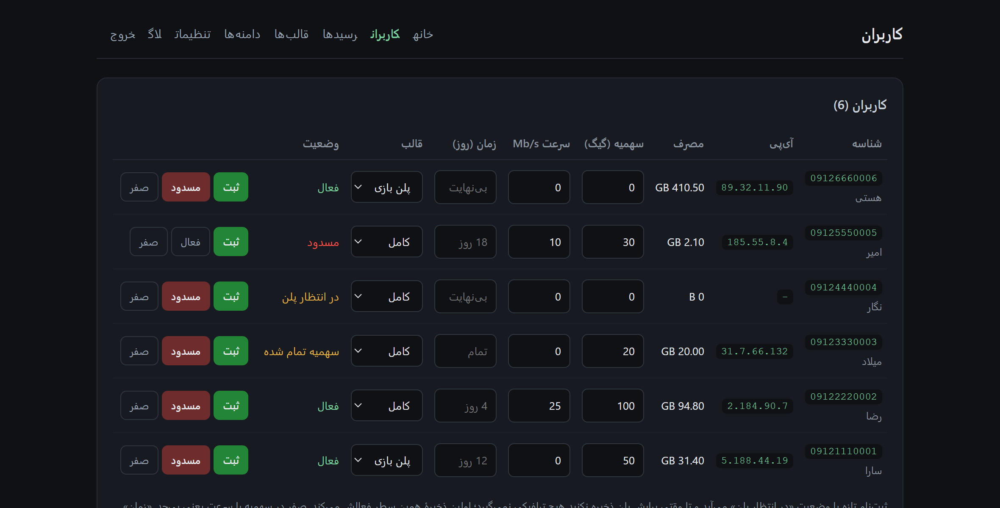
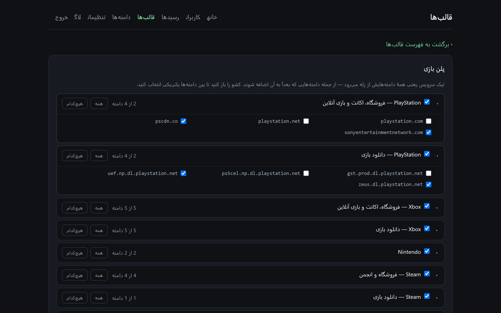
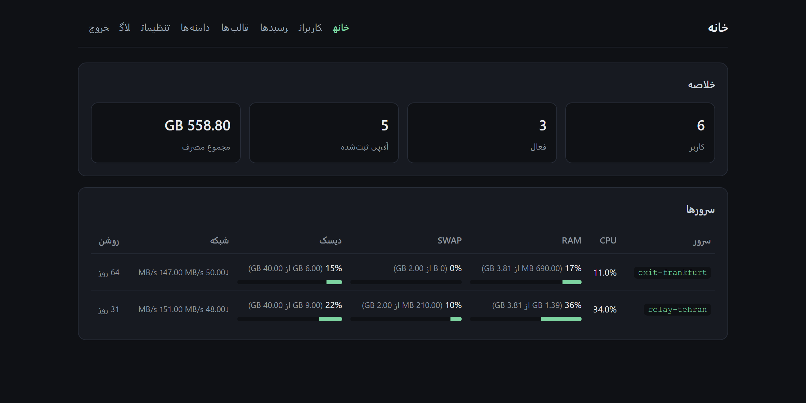
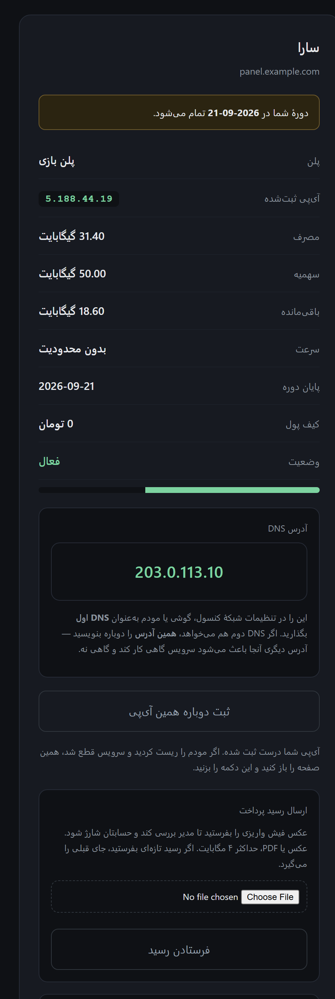

<h2 align="center">تقدیم به حدیث❤️ که منو تو اولین پروژم یاری و تحمل کرد</h2>

# doctor dns

*[English](README.md)*

یک سرویس Smart DNS برای ایران، در دو نیمه: یک **رله** داخل کشور و یک **خروجی** بیرون از آن. دامنه‌های تحریمی به رله resolve می‌شوند و رله آن اتصال‌ها را به بیرون می‌برد؛ بقیهٔ اینترنت مثل همیشه resolve می‌شود و مستقیم می‌رود.

این یک سرویس کامل است، نه فقط یک پروکسی — کنترل دسترسی به‌ازای هر مشتری، حساب‌کردن ترافیک، سهمیه، محدودیت سرعت، یک پنل مشتری و یک پنل اپراتور، همه در یک اسکریپت نصب، بدون هیچ وابستگی بیرون از آنچه خود دبیان دارد.

> **نسخهٔ آلفا:** با bug report های خودتون در مسیر ارتقای این پروژه مارو همکاری کنید.

گزارش باگ الان از هر چیز دیگری بیشتر به درد می‌خورد. اگر چیزی خراب شد، یا سرویسی که انتظار داشتید کار کند نکرد، [یک issue باز کنید](https://github.com/mehdi047/doctor-dns/issues) — بنویسید کدام طرف بود، چه اجرا کردید، و چه شد. گزارشِ اینکه یک کنسول یک دانلود را نصفه گذاشته واقعاً به کار می‌آید؛ بیشتر چیزی که در این پروژه هست، دقیقاً از همین راه یاد گرفته شده.

---

## چه کار می‌کند

```
   customer            relay (Iran)              exit (abroad)          service
  ┌────────┐          ┌────────────┐            ┌───────────┐        ┌─────────┐
  │ PS5    │   DNS    │ dnsmasq    │            │           │        │ Sony    │
  │ phone  │ ───────► │  answers   │            │  nginx    │        │ Spotify │
  │ PC     │          │  with self │            │  reads    │        │ …       │
  │        │   TLS    │ nginx      │ ─────────► │  the SNI  │ ─────► │         │
  └────────┘ ───────► │  SNI proxy │            │           │        └─────────┘
                      │ nftables   │            └───────────┘
                      │  gate +    │
                      │  counters  │
                      └────────────┘
```

رله هیچ‌وقت TLS را باز نمی‌کند. nginx فقط SNI را از handshake می‌خواند و یک تونل TCP ساده به خروجی باز می‌کند، و خروجی هم همین کار را می‌کند و به میزبان واقعی وصل می‌شود. هیچ چیزی رمزگشایی نمی‌شود و هیچ گواهی‌ای به کلاینت نشان داده نمی‌شود.

پورت ۸۰ به‌جای redirect، forward می‌شود؛ چون سونی و مایکروسافت بستهٔ بازی‌ها را روی HTTP ساده از لبه‌های Akamai سرو می‌کنند که اگر ۴۴۳ را بزنی، گواهی‌ای برمی‌گردانند که اسم هیچ میزبان کنسولی در آن نیست.

## چه چیزهایی دارد

| | |
|---|---|
| **مسیریابی** | dnsmasq حدود ۴۸۰ دامنهٔ تحریمی را می‌رباید؛ پاسخ‌های AAAA فیلتر می‌شوند تا کلاینت نتواند از کنار پروکسی رد شود |
| **بازی‌ها** | فروشگاه و دانلود PlayStation، Xbox و Steam؛ EA، Epic؛ STUN/TURN روی رله تا تشخیص NAT کنسول‌ها همچنان کار کند |
| **کنترل دسترسی** | یک allowlist روی nftables بر پایهٔ آی‌پی مشتری، با شمارندهٔ بایت به‌ازای هر آی‌پی داخل کرنل |
| **سهمیه** | ماهانه یا یک‌بارمصرف، با هشدار روی ۸۰٪ و ۹۵٪ و قطع خودکار |
| **محدودیت سرعت** | سقف دانلود به‌ازای هر مشتری، با htb + fq_codel — صف، نه دور ریختن بسته |
| **قالب سرویس** | این‌که پلن یک مشتری کدام برندها را از رله می‌برد، تا سطح تک‌تک دامنه‌ها؛ چند گروه هم هست که دیده می‌شود ولی تیک‌نخورده می‌آید، چون مسیریابی‌شان همان چیزی را می‌شکند که به آن تعلق دارد |
| **پنل مشتری** | ثبت‌نام، ثبت آی‌پی، دیدن مصرف، فرستادن رسید پرداخت |
| **پنل اپراتور** | مشتری‌ها، قالب‌ها، دامنه‌ها، پایش سرورها، بکاپ و بازگردانی |
| **TLS** | گواهی خودکار گرفته و تمدید می‌شود و چیزی جز یک نام دامنه نمی‌خواهد |

## چه شکلی است

پنل اپراتور، روی سرور خارج. مشتری‌ها، مصرف هرکدام، سهمیه، سقف سرعت و روزهای باقی‌مانده — همه در همان سطر قابل ویرایش‌اند:



قالب تعیین می‌کند پلن یک مشتری کدام برندها را از رله می‌برد. هر سرویس را باز کنید، دامنه‌هایش را می‌شود یکی‌یکی انتخاب کرد؛ آن یادداشت نارنجی گروهی است که پیش‌فرض خاموش می‌آید، چون مسیریابی‌اش همان چیزی را می‌شکند که به آن تعلق دارد:



و خود سرورها، که هر سی ثانیه گزارش می‌دهند:



صفحهٔ خود مشتری، که رله سرو می‌کند. باقی‌ماندهٔ سهمیه، آدرس DNS که باید در کنسول بنویسد، و دکمه‌ای که بعد از عوض‌شدن آی‌پی توسط اپراتور اینترنت، دوباره ثبتش می‌کند:



*(مشتری‌های این تصویرها ساختگی‌اند. هیچ‌کدام واقعی نیستند.)*

## نصب

یک اسکریپت، یک بار روی هر ماشین. خودش می‌پرسد کدام طرف است و آدرس طرف مقابل چیست.

```sh
curl -fsSLO https://raw.githubusercontent.com/mehdi047/doctor-dns/main/doctor-dns.sh && sudo bash doctor-dns.sh
```

این‌که دانلود می‌کند و pipe نمی‌کند عمدی است. هر کانفیگی که این اسکریپت می‌نویسد، داخل خودش زیر `exit 0` ذخیره شده — پس باید بتواند فایل خودش را بخواند؛ ضمن اینکه سؤال هم می‌پرسد و یک pipe همهٔ آن سؤال‌ها را با end-of-file جواب می‌دهد. دانلود کردن یک نسخه هم برایتان جا می‌گذارد که بخوانیدش، دوباره اجرایش کنید، و از همان حذفش کنید. اگر آن نسخه کامل نرسیده باشد، اجرا نمی‌شود.

اول **خروجی** را نصب کنید: یک توکن جفت‌شدن چاپ می‌کند که رله از شما می‌خواهد.

اجرای دوباره‌اش بی‌خطر است — از کانفیگ‌ها بکاپ گرفته می‌شود و مرحله‌ای که چیزی را تغییر نمی‌دهد، کاری هم نمی‌کند. `sudo bash doctor-dns.sh --uninstall` ماشین را برمی‌گرداند و فقط کاری را برمی‌دارد که خود این اسکریپت کرده بود.

### ارتقا

فایل جدید را دانلود کنید و اجرا کنید. قبل از اینکه دست به چیزی بزند، نسخهٔ خودش را با آنچه روی ماشین است مقایسه می‌کند، می‌گوید دارد به کدام طرف می‌رود، و منتظر جواب می‌ماند:

```
Version

    installed on this machine:  0.1.0
    this file:                  0.2.0

    this will upgrade this machine from 0.1.0 to 0.2.0.
    your customers, settings, certificates and allowlist are kept.

  go ahead? [y]:
```

ولی حالتی که واقعاً به‌خاطرش وجود دارد آن یکی است: فایل قدیمی‌ای که چند ماه در پوشهٔ خانگی مانده و دوباره اجرا می‌شود. آن وقت می‌گوید این فایل از نصب‌شده قدیمی‌تر است و جواب پیش‌فرض «نه» می‌شود.

مشتری‌ها، مصرفشان، کلید همگام‌سازی، رمز پنل و هر گواهی — همه بیرون از فایل‌هایی هستند که این اسکریپت می‌نویسد، پس ارتقا نگهشان می‌دارد. با این حال اول یک کپی از دیتابیس در `/var/backups/smart-dns/` گرفته می‌شود، آن هم با `VACUUM INTO` نه `cp`؛ چون پنل کنار دیتابیس یک write-ahead log نگه می‌دارد و کپی‌کردن خود فایل می‌تواند تازه‌ترین ردیف‌ها را جا بیندازد. `--version` نسخهٔ یک فایل را بدون نصب چیزی چاپ می‌کند، و `ASSUME_YES=1` جواب پیش‌فرض را می‌گیرد — برای ارتقا «بله»، برای برگشت به عقب «نه».

### پیش‌نیازها

دو ماشین با دبیان یا اوبونتو و یک آی‌پی عمومی برای هرکدام:

- **رله** — داخل ایران، همان آدرسی که مشتری DNS خود را رویش می‌گذارد
- **خروجی** — بیرون، طوری که رله بتواند به آن برسد

نه pip، نه npm، نه کانتینر. فقط کتابخانهٔ استاندارد پایتون، nginx، dnsmasq، nftables و coturn — همه از مخزن خود توزیع.

### انتخاب سرور — تجربه‌های ما

سرعت و کارکرد این سرویس بیش از آنکه به خود اسکریپت وابسته باشد، به مسیر میان سرور ایران و سرور خارج بستگی دارد. فیلترینگ با همهٔ سرورهای خارجی یکسان رفتار نمی‌کند: برخی را آزاد می‌گذارد، برخی را کُند می‌کند و برخی را عملاً می‌بندد. نتایج زیر حاصل آزمایش‌های ماست، تا هزینه‌تان صرف سروری نشود که کار نمی‌کند.

| سرور خارج | نتیجه |
|---|---|
| AWS Lightsail آلمان | بدون مشکل کار کرد |
| Hetzner (آلمان و فنلاند) | بدون مشکل و سریع، حدود ۲ مگابایت بر ثانیه |
| Linode فرانکفورت، OVH فرانسه، یک سرور در ترکیه | به‌خوبی کار کرد |
| DigitalOcean | در هیچ‌یک از ۸ منطقه‌ای که آزمایش شد کار نکرد؛ اتصال برقرار می‌شود، اما پس از چند کیلوبایت دیگر داده‌ای عبور نمی‌کند |
| OVH (برخی آی‌پی‌های جدید) | همان مشکل DigitalOcean |
| Vultr میامی | کار می‌کند، اما بسیار کُند است؛ حدود ۱۰۰ کیلوبایت بر ثانیه |

چند نکته:

- سریع دانلود شدن فایل آزمایشی یک شرکت از داخل ایران تضمین نمی‌کند که سروری که از همان شرکت می‌خرید هم سریع باشد؛ این را در OVH و Vultr به‌وضوح دیدیم.
- یک سرور خارج ممکن است با یک سرور ایران به‌خوبی کار کند و با سرور ایران دیگری نه.
- سرویس روی اینترنت‌های مختلف رفتار یکسانی نداشت: با یک پیکربندی ثابت، روی اینترنت موبایل به‌خوبی کار می‌کرد، اما روی اینترنت خانه بسیار کُند بود. پس سرویس را روی اینترنت‌هایی که مشتریانتان استفاده می‌کنند هم آزمایش کنید.

**پیشنهاد ما:** اگر برای راه‌اندازی این اسکریپت سرور تهیه می‌کنید، ابتدا سرور ایران و سرور خارج را به‌صورت ساعتی بگیرید. سرویس را راه‌اندازی کنید و روی اینترنت‌های مختلف بیازمایید، و تنها در صورت رضایت، سرورها را برای مدت طولانی‌تر تمدید کنید.

### پورت‌ها

همهٔ پورت‌های زیر را خودِ سرویس گرفته است. در فایروال بازشان کنید، و هیچ‌کدام را به پنل ادمین ندهید — نصب‌کننده جلوی آن‌هایی را که می‌بیند می‌گیرد، ولی قانون فایروالی که خودتان نوشته‌اید را نمی‌بیند.

| | رله (داخل ایران) | خروجی (بیرون) |
|---|---|---|
| **53** udp + tcp | dnsmasq؛ همان آدرسی که مشتری DNS خود را رویش می‌گذارد | — |
| **80** tcp | به بیرون forward می‌شود؛ گواهی هم از همین‌جا اثبات می‌شود | همان |
| **443** tcp | پروکسی SNI | همان |
| **3478** udp | STUN، تا کنسول بتواند نوع NAT خودش را تشخیص دهد | — |
| **8443** tcp | پنل مشتری — فقط روی TLS، پس رلهٔ بدون گواهی اصلاً پنلی سرو نمی‌کند | API همگام‌سازی که رله‌ها به آن وصل می‌شوند |
| **8446** tcp | — | فقط روی loopback: مسیر خود خروجی به گوگل روی IPv6، هر جا IPv6 داشته باشد |
| **22** tcp | ssh — هیچ‌وقت پشت دروازه نیست، تا allowlist اشتباه شما را بیرون نیندازد | همان |

پنل ادمین تنها پورتی است که خودتان انتخاب می‌کنید. پیش‌فرضش **9443** است و هر پورت آزادی می‌تواند باشد؛ نصب‌کننده روی 22، 53، 80، 443، 8443 و 8446 جلویتان را می‌گیرد، و `smartdns-access port` بعداً همان قانون را اعمال می‌کند به‌علاوهٔ یک بررسی که چیز دیگری از قبل روی آن پورت گوش نداده باشد.

از بیرون، رله همان ماشینی است که مشتری به آن می‌رسد، پس پورت‌های DNS و پروکسی و STUN و پنلش باید روی اینترنت باز باشند. خروجی فقط از رله و از شما صدا می‌شنود، پس همان 80 و 443 و 8443 و پورت پنل کافی است.

### کنترل دسترسی

یک رلهٔ تازه به همه جواب می‌دهد. این تصمیم کسی نیست؛ واقعیت این است که رله قبل از ثبت اولین آی‌پی نصب می‌شود و بستنِ آن روی یک allowlist خالی یعنی قطع‌کردن همهٔ کاربرها یکجا — از جمله خود اپراتور.

پس رله در اولین sync که یک آی‌پی ثبت‌شده بیاورد، خودش را می‌بندد، و از آن به بعد فقط آی‌پی‌های ثبت‌شده DNS و HTTP و HTTPS می‌گیرند. SSH هیچ‌وقت پشت این دروازه نیست، تا یک allowlist اشتباه دسترسی کسی به ماشین را نگیرد.

```sh
smartdns-acl enforce status   # الان کدام حالت است
smartdns-acl enforce off      # باز بماند، و بستن خودکار لغو شود
```

با `ENFORCE=no` روی خط فرمان نصب، از همان اول انصراف می‌دهید.

## بعد از نصب

هر طرف در پایان نصب می‌گوید چه چیزی راه انداخته: رله آدرس DNS و پنل مشتری را می‌گوید، خروجی پنل اپراتور و رمزش را — رمز فقط همان یک بار نشان داده می‌شود.

پنل اپراتور تمام رابط مدیریتی است: مشتری‌ها، سهمیه و سرعتشان، قالب‌های سرویس، فهرست دامنه‌ها، پایش سرورها، رسیدهای پرداخت، و بکاپ و بازگردانی. چیزهای زیر برای مواردی هستند که یک صفحهٔ وب نمی‌تواند حلشان کند: خواندن وضعیت از روی ssh، و برگشتن به پنلی که دیگر به آن نمی‌رسید.

### روی خروجی

**`smartdns-access`** — پنل ادمین کجاست و چطور عوضش کنید. بدون آرگومان که اجرا شود، آدرس کامل را چاپ می‌کند؛ از همان کانفیگی می‌خواند که پنل واقعاً با آن سرو می‌شود.

```sh
smartdns-access                  # آدرسی که جواب می‌دهد — یادتان رفته؟ از اینجا
smartdns-access port 9443        # جابه‌جایی، اگر فایروال سر راه است
smartdns-access path [new]       # مسیر مخفی را عوض یا از نو قرعه بکش
smartdns-access password [new]   # رمز تازه؛ رمز قبلی بازیابی‌شدنی نیست
smartdns-access rotate           # مسیر تازه و رمز تازه، با هم
```

از این سه تا، فقط **رمز** واقعاً احراز هویت است. پورت فقط پنل را از سر راه اسکن اتفاقی کنار می‌برد و بس؛ مسیر هرچند حدس‌نزدنی است، در هر درخواست سفر می‌کند و در لاگ هر پروکسی سر راه می‌نشیند. رمز هیچ‌وقت ذخیره نمی‌شود — فقط هَش نمکی‌اش — و برای همین رمز فراموش‌شده جایگزین می‌شود، نه بازیابی.

### روی رله

**`smartdns`** — فهرست دامنه‌هایی که از رله رد می‌شوند.

```sh
smartdns status                  # این ماشین دارد چه کار می‌کند
smartdns list                    # هر دامنه‌ای که مسیریابی می‌شود
smartdns find spotify            # کدام‌ها می‌خورند
smartdns add example.com         # یکی دیگر را هم از رله ببر
smartdns del example.com         # دیگر نبر
smartdns bypass api.example.com  # این یکی هیچ‌وقت از رله نرود، حتی با اینکه
                                 # والدش می‌رود — برای سرویس‌هایی که اصلاً
                                 # روی ۴۴۳ نیستند
smartdns test example.com        # این رله برایش چه جواب می‌دهد
```

**`smartdns-rules`** — هر قالب با یک دامنه چه می‌کند، پرسیده از خود resolverها. هر قالبی که مشتری دارد resolver خودش را روی رله می‌گیرد؛ قالب پیش‌فرض همان resolver روی پورت ۵۳ است.

```sh
smartdns-rules                   # همهٔ قالب‌ها: پورت، مشتری‌ها، و اینکه چند
                                 # دامنه را redirect، bypass و pin می‌کنند
smartdns-rules show test         # فهرست کامل یک قالب
smartdns-rules check gemini.google.com
                                 # قانون هر قالب برای آن، و جوابی که resolverش
                                 # واقعاً می‌دهد - اگر نخوانند، هشدار می‌دهد
```

**`smartdns-acl`** — چه کسی اجازهٔ استفاده از رله را دارد و چقدر مصرف کرده. پنل به‌جای دست‌زدن مستقیم به nftables همین را صدا می‌زند، تا قانونِ اینکه چه چیزی مجاز است یک جا بیشتر نباشد.

```sh
smartdns-acl list                # همه، با مصرفشان
smartdns-acl usage 5.188.44.19   # یک آدرس
smartdns-acl add 5.188.44.19 ali # دستی ثبت کن
smartdns-acl del 5.188.44.19
smartdns-acl reset <ip>|--all    # صفر کردن شمارنده‌ها
smartdns-acl enforce status      # باز است یا فقط آدرس‌های ثبت‌شده؟
smartdns-acl enforce on          # ببند
smartdns-acl enforce off         # برای همه باز کن
smartdns-acl save                # همین حالا روی دیسک ذخیره کن
```

`enforce on` وقتی هیچ‌کس ثبت نشده باشد امتناع می‌کند — بستن یک رلهٔ زنده روی لیست خالی یعنی قطع‌کردن همهٔ مشتری‌ها یکجا، و این اشتباهی است که از آن‌طرفِ یک اتصال قطع‌شده برگشت‌ناپذیر به نظر می‌رسد. اگر واقعاً منظورتان همان است، `--allow-empty` را اضافه کنید. `--json` روی `list` و `usage` خروجی‌ای می‌دهد که برای برنامه است نه آدم.

**`smartdns-shape`** — سقف دانلود به‌ازای هر مشتری، با htb + fq_codel.

```sh
smartdns-shape list              # چه چیزی الان اعمال است
smartdns-shape off               # همهٔ محدودیت‌ها را بردار
```

عامل همگام‌سازی این‌ها را هر سی ثانیه از پنل می‌گیرد و اعمال می‌کند، پس سرعت را آنجا تنظیم کنید نه اینجا.

### روی هر دو

**`smartdns-logs`** — این ماشین چه کرده، همهٔ بخش‌هایش با هم. خودش تشخیص می‌دهد رله است یا خروجی.

```sh
sudo smartdns-logs               # هر بخش: روشن است یا نه، و ۱۰۰ خط آخرش
sudo smartdns-logs -e            # فقط هشدارها و خطاها
sudo smartdns-logs -f            # دنبال‌کردن زنده؛ ‎-e -f‎ فقط برای مشکل‌ها
sudo smartdns-logs -n 500        # خطوط بیشتر برای هر بخش
sudo smartdns-logs --report      # همه‌اش در یک فایل برای فرستادن، رمزها پوشانده
```

پنل‌ها برای هر درخواست و هر کار اپراتور یک خط می‌نویسند، و رله هر دامنه‌ای را که در هر قالب مسیرش عوض شود و هر مشتری‌ای را که بین قالب‌ها جابه‌جا شود ثبت می‌کند. هشدارها و خطاها سطح syslog دارند و `-e` همان را می‌خواند. رمز، نشست و توکن هیچ‌وقت نوشته نمی‌شوند. خروجی معمولی برای صفحهٔ خودتان است — خط شروع پنل ادمین آدرسش را دارد. `--report` هر رمزی را که در کانفیگ ماشین هست، هر جا پیدا شود، می‌پوشاند و آن آدرس هم جزوش است؛ ولی آی‌پی و یوزرنیم مشتری‌ها در آن می‌ماند، پس فقط برای کسی بفرستید که به او اعتماد دارید.

```sh
smartdns-cert panel.example.com  # گواهی برای آن نام بگیر یا تمدید کن
sudo bash doctor-dns.sh --version
sudo bash doctor-dns.sh --uninstall
```

`smartdns-cert` برای بیست ثانیه‌ای که چالش طول می‌کشد پورت ۸۰ را قرض می‌گیرد، پس دانلود کنسول از روی رله همان‌قدر گیر می‌کند و بعد ادامه می‌دهد. یک تایمر خودش تمدید می‌کند، از وقتی چیزی برای تمدید باشد.

## چطور ساخته می‌شود

`doctor-dns.sh` تولید می‌شود، دستی ویرایش نمی‌شود. همه‌چیز در `templates/`، `common/` و `domains/` است؛ `tools/installer-logic.sh` منطق اسکریپت است و `tools/build-installer.py` این‌ها را به هم می‌دوزد:

```sh
python3 tools/build-installer.py   # doctor-dns.sh را بازنویسی می‌کند
bash -n doctor-dns.sh              # همچنان بشِ معتبر می‌ماند
python3 tools/test-websignup.py    # …و همین‌طور بقیهٔ تست‌ها
```

payloadها زیر `exit 0` می‌نشینند و هر خطشان با `#` شروع می‌شود؛ همین است که کل فایل را بشِ معتبر نگه می‌دارد — پس `bash -n` واقعاً چیزی را بررسی می‌کند، و هر کسی می‌تواند قبل از اجرا با root، تک‌تک کانفیگ‌هایی را که قرار است اجرا شوند بخواند.

## شکل یک استقرار

یک دیتابیس به همهٔ رله‌ها سرویس می‌دهد. همین است که باعث می‌شود سهمیهٔ یک مشتری در کل سرویس یک معنی داشته باشد، نه یک معنی به‌ازای هر ماشین.

```
  exit node                          relay(s)
  ┌──────────────────────┐          ┌──────────────────────┐
  │ smartdns-panel       │ ◄─────── │ smartdns-sync        │
  │  sqlite + sync API   │   30s    │  usage up,           │
  │                      │ ───────► │  allowlist down      │
  │ smartdns-admin       │          │                      │
  │  operator's panel    │          │ customer's panel     │
  └──────────────────────┘          └──────────────────────┘
```

همیشه رله است که تماس را برقرار می‌کند. رله در موقعیت شبکه‌ایِ سخت‌تری است و این‌طوری به هیچ پورت ورودی تازه‌ای نیاز ندارد.

پنل مشتری روی رله است، چون کل نکتهٔ آن یاد گرفتن آی‌پی مشتری است و فقط رله آی‌پی‌ای را می‌بیند که مشتری واقعاً از آن به سرویس می‌رسد.

## محدودیت‌های شناخته‌شده

- **آپلود شکل داده نمی‌شود.** فقط جهت دانلود سقف دارد. محدودکردن ورودی به یک دستگاه ifb نیاز دارد و به‌جای صف، بسته دور می‌ریزد — برای سرویسی که ترافیکش غالباً ورودی است.
- **رلهٔ بدون گواهی پنل مشتری ندارد.** آن صفحه رمز می‌پرسد، و اینجا هیچ‌چیز روی HTTP ساده رمز نمی‌پرسد — پس اصلاً سرو نمی‌شود، نه اینکه ناامن سرو شود. روی چنین رله‌ای کسی نمی‌تواند ثبت‌نام کند یا آی‌پی ثبت کند، تا وقتی دامنه‌ای به آن بدهید.
- **فروش ساخته نشده، و تست هم وجود ندارد.** ثبت‌نام یک حساب می‌دهد، یک رمز، و جایی برای فرستادن رسید — نه ترافیک. حساب منتظر می‌ماند تا اپراتور سطرش را باز کند و برایش پلن ثبت کند؛ همان لحظه است که اصلاً می‌تواند وصل شود.
- **دانلود Xbox گیر می‌کند**، چه از رله برود چه نرود. اندازه‌گیری شده، حل نشده.
- **ترافیک دو برابر خرج می‌شود.** یک گیگابایتِ مشتری تقریباً می‌شود دو گیگ روی رله و دو گیگ روی خروجی — اندازه‌گیری شده، و قبل از قیمت‌گذاری ارزش دانستن دارد.

## مشارکت‌کننده‌ها

- [آرمین ترنج](https://github.com/arminandtoo) — `@arminandtoo`

---

<div align="center">

## ☕ حمایت از پروژه

**این پروژه رایگان است و رایگان هم می‌ماند.**

از برنامه های اوپن سورس حمایت کنیم❤️<br>
زنده باد برنامه آزاد🕊<br>
زنده باد اینترنت آزاد🌐

</div>

<div align="center">

| | |
|:--|:--|
| **TON** | `UQAh8oTWt8ec-q4I1zxga1sUYmKmvcQKGDYwspDrsGmUlQKI` |
| **Tether — BEP20** | `0x8aE738721Ca6Fd9a8a375Df3AC4A144ed5695355` |
| **Tether — TRON (TRC20)** | `TPiyEnb41qTZz8eM6eqnRwXbPXBZCNS1pm` |

</div>

## لایسنس

MIT. فایل [LICENSE](LICENSE) را ببینید.

فهرست دامنه‌ها از منابع عمومی و از تست عملی جمع شده؛ کامل نیست و با تغییر سرویس‌ها جابه‌جا می‌شود.
